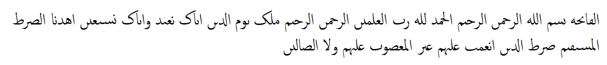

# rasmifize

Convert arabic strings to their rasm. This includes:

* Removing diacritics
* Removing vocalization marks

**Text with diacritics and vocalization marks etc**


**Text without diacritics (rasm)**


## rasmifize vs. rasmify.js

`rasmifize` is the successor to [rasmify.js](https://github.com/telota/rasmify.js/). I developed `rasmify.js` with the team of Corpus Coranicum at the Berlin-Brandenburg Academy of Sciences and Humanities.

Since I want to maintain this *rasm* library, I have decided to publish a successor under my own name.

## Install

```
npm install rasmifize
```

## How to use

### TypeScript

```ts
import { rasmifize } from 'rasmifize';

const arabicString: string = 'الفَاتِحَة';

rasmifize(arabicString); // الڡاٮحه
```

### JavaScript

```js
const rasmifize = require('rasmifize');

const arabicString = 'الفَاتِحَة';

rasmifize(arabicString); // الڡاٮحه
```